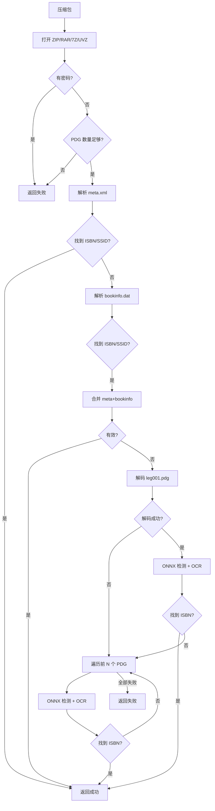

# 压缩包提取流程

从 ZIP / RAR / 7Z / UVZ 压缩包中提取 ISBN。

## 流程概述

## 数据来源优先级

| 优先级 | 来源 | 速度 | 提取方式 | 说明 |
|--------|------|------|----------|------|
| 1 (最高) | `meta.xml` | ~10-20ms | XML 解析 | 含 `<ssid>` / `<isbn>`，编码兼容 UTF-8/GB18030 |
| 2 | `bookinfo.dat` | ~5-10ms | INI 键值对解析 | 超星 PDG 专用配置，含 ISBN / SSID |
| 3 | `leg001.pdg` | ~200-500ms | PDG 解码 → ONNX → OCR | 版权页图片，CIP 规则提取 |
| 4 (兜底) | 前 N 个 PDG | N × 200-500ms | PDG 解码 → ONNX → OCR | 由 `pdg_fallback_count` 控制 |

## 合并策略

`meta.xml` 和 `bookinfo.dat` 的结果会**合并**（`_merge_metadata`）：

- **互不覆盖** — 前面来源已有的字段不会被后面覆写
- **任一有效即止** — 合并后只要 ISBN 或 SSID 任一满足 `strict` 等级，立即返回
- **不降级** — 文本元数据成功后不走图片路径，避免不必要的 ONNX 开销

## 关键步骤

1. **格式支持** — ZIP / UVZ / RAR / 7Z 四种格式，通过 `_ArchiveReader` 抽象层统一访问
2. **meta.xml** — 新增的元数据来源，编码兼容 UTF-8 和 GB18030（声明与实际不符时自动兜底）
3. **bookinfo.dat** — SSID（SS 号）可作为标识，严格等级 3 时 SSID 足以通过校验
4. **PDG 解码** — 先检测文件头（jpg/png），失败后用 PdgView.dll 解码
5. **SSID 回退** — 无 ISBN 时有 SSID 也可快速返回，避免 ONNX 路径

## 编码兼容性

`meta.xml` 解析支持以下编码场景：

- UTF-8 正确声明 → 直解析
- GB18030 正确声明 → 解码兜底
- 声明 UTF-8 但实际 GB18030 → 解码兜底
- 无声明 → UTF-8 默认
