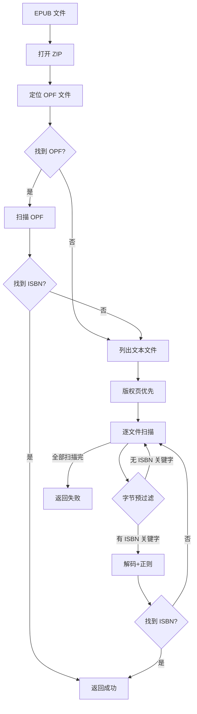

# EPUB 提取流程

从 EPUB 文件中提取 ISBN，纯文本扫描，无需 OCR。

## 流程概述

## 特点

- **纯文本扫描** — 无需 ONNX 检测和 OCR，速度极快（通常 1-10ms）
- **字节级预过滤** — 先检查文件是否含 `b"ISBN"` 或 `b"978"`，避免无效解码
- **版权页优先** — 优先扫描 copyright/titlepage/colophon 等文件
- **多编码支持** — 自动检测 utf-8 / utf-16-le / gb18030 / big5
