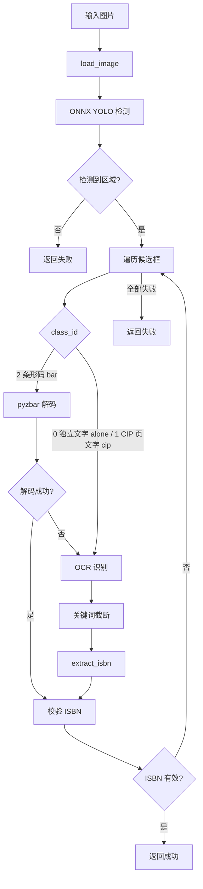

# 图片提取流程

从单张图片文件中提取 ISBN 的完整流程。

## 流程概述

## 关键步骤

1. **图片加载** — `load_image()` 统一处理路径/bytes/ndarray/PIL 输入，自动 EXIF 矫正
2. **ONNX 检测** — `Detector.detect()` 预处理 → 推理 → 坐标映射 → 裁剪候选区域
3. **检测类别** — class_id 映射：`0=alone`（独立 ISBN 文字）、`1=cip`（CIP 页 ISBN）、`2=bar`（条形码）。条形码优先 pyzbar 解码，失败再走 OCR；文字类直接 OCR
4. **OCR 识别** — RapidOCR 识别文字，ISBN 关键词截断，正则提取
5. **ISBN 校验** — `BookInfo.is_valid()` 按严格等级校验
