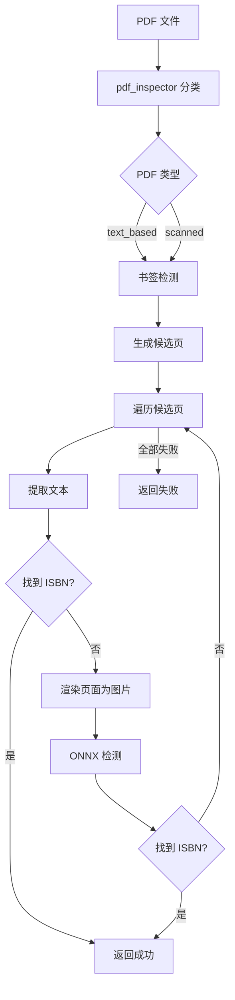

# PDF 提取流程

从 PDF 文件中提取 ISBN，支持文本型 PDF 和扫描件。

## 流程概述

## 关键步骤

1. **PDF 分类** — `pdf_inspector` 判断 PDF 为文本型或扫描型
2. **书签检测** — 按关键词"版权"/"封底"查找书签页，优先级最高
3. **候选页** — 前 2-10 页 + 后 5-1 页，书签页优先
4. **文本提取** — text_based 时 `page.get_text()` 后正则搜索 ISBN
5. **渲染+ONNX** — 扫描件/文本失败时渲染页面为图片，走 ONNX 检测
